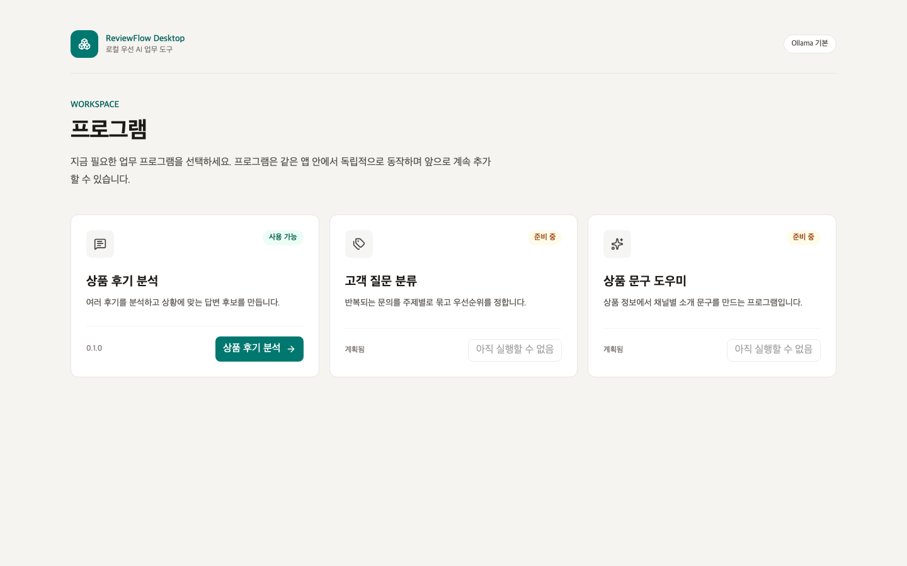
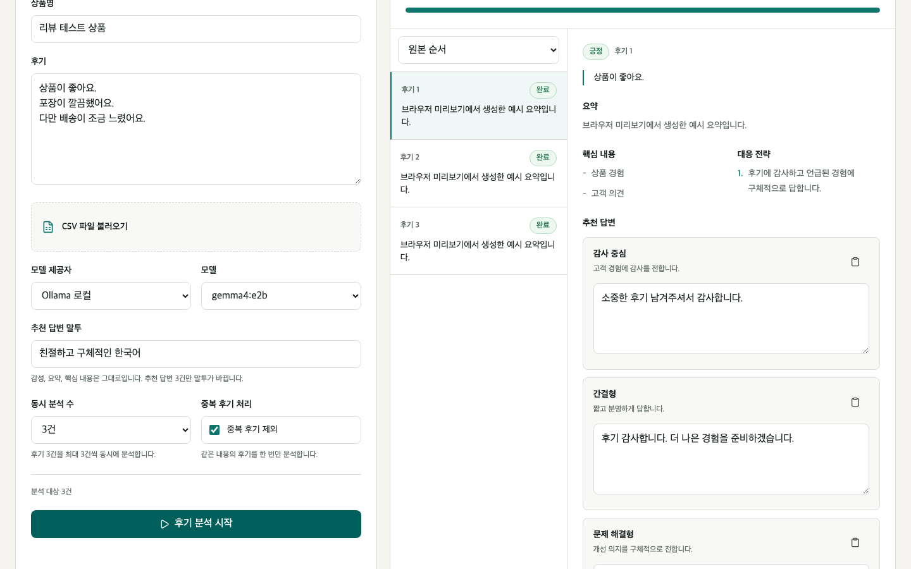

# ReviewFlow Desktop

## 주요 스택

### LangChain
- LangChain (Core)
- RAG
- LLM Agentic

### 플랫폼
- Rust Tauri
- Node.js
- Python

### 모델 및 API
- OLLAMA (e2b, e4b)
- OpenAI API
- Claude API

## 화면 미리보기





여러 상품 후기를 동시에 분석하고 고객 답변 후보를 만드는 Tauri 데스크톱 앱입니다. 첫 화면은 프로그램 런처이며, 앞으로 같은 앱에 다른 AI 업무 프로그램을 계속 추가할 수 있습니다.

첫 번째 프로그램인 상품 후기 분석기는 다음 작업을 한 흐름으로 처리합니다.

- 직접 입력 또는 CSV로 후기 최대 200건 준비
- 후기별 긍정, 부정, 중립 감성 분류
- 요약, 핵심 내용, 대응 전략 생성
- 서로 다른 고객 답변 후보 3개 생성
- 후기별 부분 실패 유지와 실패 항목 재시도
- 답변 수정과 복사
- CSV와 JSON 결과 내보내기

## 화면 구성

1. 프로그램 런처에서 사용할 프로그램을 선택합니다.
2. 상품명, 브랜드 말투, 모델과 동시 처리 수를 설정합니다.
3. 후기를 붙여넣거나 CSV의 후기 열을 선택합니다.
4. 분석 중 완료 수, 실패 수, 전체 수를 확인합니다.
5. 후기별 요약과 답변 후보를 비교하고 필요한 문구를 수정합니다.
6. 결과를 CSV 또는 JSON으로 저장합니다.

브라우저 개발 화면에서는 UI 흐름을 확인할 수 있도록 예시 분석 결과를 생성합니다. 실제 LangChain과 Ollama 분석은 Tauri 앱에서 실행됩니다.

## 기술 구조

```text
React 웹뷰
  -> Tauri Rust 명령 계층
    -> 버전이 있는 JSONL 계약
      -> Python sidecar
        -> LangChain 구조화 출력
          -> Ollama, Groq 또는 OpenAI
```

- React 웹뷰는 API 키를 읽거나 모델을 직접 호출하지 않습니다.
- Rust는 sidecar 실행, 취소, 이벤트 계약 검증, 파일 저장을 담당합니다.
- Python은 Pydantic으로 입력과 출력을 검증하고 후기 단위로 병렬 처리합니다.
- 완료 순서와 관계없이 `source_index`로 원본 순서를 복원할 수 있습니다.
- 한 후기의 실패가 다른 후기 결과를 지우지 않습니다.

## 저장소 구조

```text
src/features/launcher/            프로그램 목록과 등록 정보
src/features/review-analyzer/     후기 분석 React 화면과 상태
src-tauri/src/                     Tauri 명령, 이벤트, 내보내기 검증
review_analyzer/                   LangChain 분석과 JSONL sidecar
scripts/build-sidecar.mjs          PyInstaller 패키징
tests/review_analyzer/             Python 분석 계층 테스트
```

## 새 프로그램 추가

1. `src/features/launcher/programs.ts`에 프로그램 이름, 설명, 상태, 경로, 필요한 권한을 등록합니다.
2. `src/features/` 아래에 프로그램별 화면과 상태 모듈을 추가합니다.
3. `src/App.tsx`에서 등록한 프로그램의 진입 화면을 연결합니다.
4. 네이티브 기능이 필요하면 Rust 명령을 추가하고 `src-tauri/capabilities/default.json`에는 필요한 권한만 허용합니다.

`coming_soon` 상태의 프로그램은 런처에 표시되지만 실행할 수 없습니다. 외부 코드를 설치하는 동적 플러그인은 현재 지원하지 않습니다.

## 요구 환경

- macOS 13 이상
- Node.js 22 이상
- pnpm 11 이상
- Rust stable
- Python 3.12
- uv
- Ollama 0.32 이상

기본 로컬 모델은 이 저장소에서 확인한 `gemma4:e2b`입니다.

```bash
ollama pull gemma4:e2b
ollama list
```

## 설치

```bash
uv sync --group dev
pnpm install
```

`uv`는 프로젝트 조건에 맞는 Python 3.12 환경을 자동으로 선택합니다. 설치 후 `uv run python --version`으로 확인할 수 있습니다.

클라우드 모델은 선택 사항입니다. 키는 `.env` 또는 실행 환경 변수에서만 읽으며 웹뷰 입력란에는 넣지 않습니다.

```bash
cp .env.example .env
```

```dotenv
GROQ_API_KEY=
OPENAI_API_KEY=
```

`.env`는 Git에서 제외됩니다. 클라우드 모델을 선택하면 실행 전에 후기 원문 외부 전송 동의를 확인합니다.

## 개발 실행

브라우저 UI만 확인하려면 다음 명령을 사용합니다.

```bash
pnpm dev
```

실제 LangChain sidecar와 Tauri 앱을 실행하려면 sidecar를 먼저 빌드합니다.

```bash
pnpm sidecar:build
pnpm tauri dev
```

sidecar는 현재 Rust 대상 아키텍처 이름을 붙여 `src-tauri/binaries/`에 생성됩니다. 생성된 실행 파일은 크기가 크기 때문에 Git에서 제외됩니다.

## 검증

```bash
uv run pytest tests/review_analyzer -q
uv run ruff check review_analyzer tests/review_analyzer
uv run basedpyright review_analyzer tests/review_analyzer

pnpm lint
pnpm typecheck
pnpm test
pnpm test:sidecar-build
pnpm build

cargo test --manifest-path src-tauri/Cargo.toml
cargo clippy --manifest-path src-tauri/Cargo.toml --all-targets -- -D warnings
cargo fmt --manifest-path src-tauri/Cargo.toml -- --check
```

## 앱 빌드

```bash
pnpm sidecar:build
pnpm tauri build
pnpm test:bundle-sidecar
```

현재 저장소의 실제 패키징 검증 대상은 macOS app과 DMG입니다. Windows와 Linux는 해당 운영체제에서 sidecar를 다시 빌드하고 Tauri 번들 테스트를 실행해야 합니다.

- 앱 번들: `src-tauri/target/release/bundle/macos/ReviewFlow Desktop.app`
- 설치 이미지: `src-tauri/target/release/bundle/dmg/ReviewFlow Desktop_0.1.0_aarch64.dmg`

로컬 macOS 빌드는 인증서가 필요 없는 ad-hoc 서명을 사용합니다. PyInstaller가 포함한 Python 동적 라이브러리를 sidecar가 읽을 수 있도록 `src-tauri/Entitlements.plist`의 라이브러리 검증 예외를 적용하며, `pnpm test:bundle-sidecar`가 서명된 앱 안의 sidecar 실행 계약을 확인합니다. 다른 사용자에게 정식 배포하려면 `APPLE_SIGNING_IDENTITY`로 Developer ID를 지정하고 공증 자격 증명을 별도로 구성해야 합니다. 이 환경 변수는 로컬 ad-hoc 기본값보다 우선합니다.

## CSV 형식

첫 행에 헤더가 있는 UTF-8 CSV를 사용합니다. 파일을 선택한 뒤 후기 내용이 들어 있는 열을 지정합니다.

```csv
review_id,review
1,배송이 빠르고 포장이 꼼꼼해요
2,색상은 예쁘지만 뚜껑이 조금 불편해요
```

CSV 내보내기는 `=`, `+`, `-`, `@`, 탭, 캐리지 리턴으로 시작하는 셀 앞에 작은따옴표를 붙여 스프레드시트 수식 실행을 막습니다.

## 보안과 데이터 처리

- 후기 원문과 API 키를 일반 로그에 기록하지 않습니다.
- 잘못된 요청 오류에 후기 원문을 되비추지 않습니다.
- Python sidecar 이벤트는 계약 버전과 Pydantic 모델을 통과해야 합니다.
- Rust는 계약 버전과 작업 식별자가 맞는 이벤트만 웹뷰로 보냅니다.
- 내보내기 파일명, 확장자, 최대 크기를 Rust에서 다시 검사합니다.
- 현재 MVP는 분석 결과를 데이터베이스에 저장하지 않습니다.

## 문서

- [상품 후기 분석 Tauri 앱 PRD](./docs/260722-1612%20-%20LangChain%20후기%20분석%20Tauri%20앱%20PRD/LangChain%20후기%20분석%20Tauri%20앱%20PRD.md)
- [구현 계획](./docs/260722-1728%20-%20후기%20분석%20Tauri%20앱%20구현%20계획/후기%20분석%20Tauri%20앱%20구현%20계획.md)
- [디자인 기준](./DESIGN.md)
- [환경 설정](./SETUP.md)

## 기존 LangChain 학습 자료

기존 노트북과 학습 코드는 삭제하지 않고 함께 유지합니다.

- `[LLM]_01_GenAI_Intro.ipynb`
- `[LLM]_02_LangChain_Core_LCEL.ipynb`
- `[LLM]_03_Prompt_Structured_Output.ipynb`
- `[LLM]_04_Tools.ipynb`
- `[LLM]_05_Agents.ipynb`
- `[LLM]_06_RAG_Data_Pipeline.ipynb`
- `project/02_lcel.py`

## 현재 제외 범위

- 쇼핑몰 후기 자동 수집
- 답변 자동 게시
- 로컬 데이터베이스와 장기 이력
- 자동 업데이트와 코드 서명 배포
- Windows와 Linux 설치 파일 실기기 검증

## 라이선스

이 저장소는 CC BY-NC-ND 4.0 라이선스를 따릅니다. 자세한 조건은 [LICENSE](./LICENSE)와 [NOTICE.md](./NOTICE.md)를 확인해 주세요.
